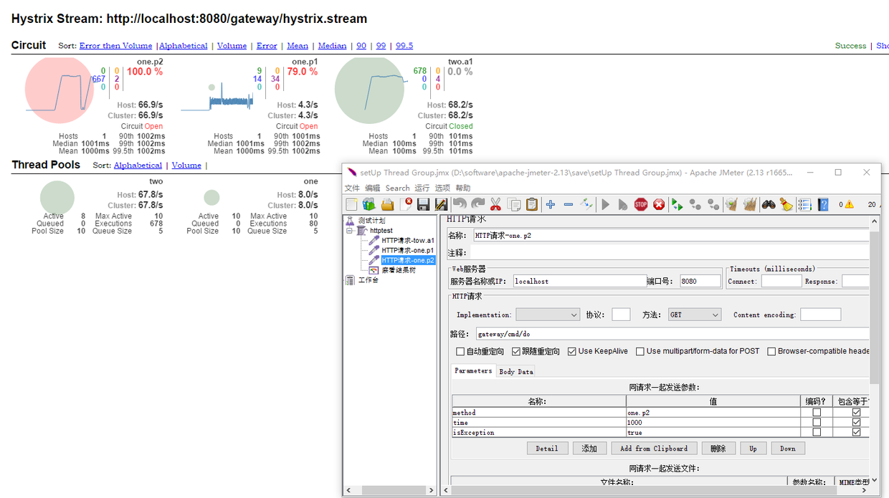

# Hystrix入门
yoho-core分布式服务的调用是通过spring的RestTemplete以http请求进行访问，通常http访问具有很多不确定因素，除了服务异常、常常还有网络或者业务引起的超时等问题(网络连接慢、资源繁忙、暂时不可用、服务脱机)。如果在web请求处理线程中直接进行http访问，在异常或者超时发生时，将会严重影响服务器的请求处理性能。当然我们可以自己封装服务调用，通过future等模式来实现服务的异步调用。yoho-core内使用Hystrix来间接的进行服务调用，服务调用过程是在hystrix管理的线程池中，因此使得服务调用过程与web线程能隔离开，保证服务器的稳定。
### 
Hystrix把服务调用统称为依赖调用，在yoho-core中主要是http访问调用，当然也可以有其他形式的依赖，比如webservice、rpc甚至本地方法。
Hystrix通过命令模式封装依赖调用，每一个依赖调用封装在HystrixCommand中，每个命令在Hystrix的线程池中运行。另外可以对其配置分组名、线程组，使得不同的依赖可以分类在不同的线程组，隔离不同模块的依赖，也可根据负载情况，配置不同组的线程数。Hystrix还提供一种熔断器(CircuitBreaker)的机制，Hystrix可以通过设定的条件判断该封装的依赖调用是否可以正确调用,如果在一定时间内调用失败次数过多，则会熔断自身，使得相同的调用无法执行，待冷却之后重新再试。

# 构造HystrixCommand
## 命名HystrixCommandKey
HystrixCommand有自己的名字，在yoho-core中即是远程服务名，比如order.cart,user.getVipInfo,product.get...等，Hystrix使用单例模式存储HystrixCommand，熔断机制正式基于单实例上的调用情况统计实现。如果不设置这个名字，Hystrix会为其设置默认的名字：类名。
## 分组HystrixCommandGroupKey
GroupKey是每个命令最少配置的必选参数，因为下一个参数HystrixThreadPoolKey如果不指定的话，其会使用该参数值
## 线程池 HystrixThreadPoolKey
ThreadPoolKey顾名思义，是HystrixCommand运行所在的线程池，如果该参数不设置则使用GroupKey作为ThreadPoolKey，这种情况下往往是同一个业务模块的依赖调用在同一个线程池内，yoho-core中使用服务模块[user,order,product等]作为GroupKey，各个模块。如果同一业务内的服务之间还需要隔离的话，就可以设置该参数，比如order的订单和购物车可以通过设置不同的ThreadPoolKey再区分到不同线程池中。
另外可以通过HystrixThreadPoolProperties设置线程池的属性，比如核心线程数大小、最大线程数、任务队列大小，和java的线程池一致，HystrixThreadPoolProperties本身也提供了一些默认值。

##### 下面是简单的一个HystrixCommand的构造过程
## run()方法
实现run方法，执行具体的依赖调用。
## getFallback()方法
如果run方法中发生异常，或者run方法运行时间过长(相当于超时),又或者线程池中任务队列已满，这时HystrixCommand会调用getFallback返回一个默认值，当然也可以在这进行特殊的出错处理,该函数是运行在web请求线程中。如果没有重写该方法，那run抛出的异常将被抛到web请求线程中。
如果某个依赖的run方法在短时间内发生异常或超时次数过多，此时Hystrix会发生熔断，该依赖新的HystrixCommand执行会直接调用getFallback返回，避免无效的调用浪费资源。当然在冷却一段时间后，新的依赖调用还是会通过run重试。
```java
		//构造setter
        HystrixCommandGroupKey groupKey = HystrixCommandGroupKey.Factory.asKey(group);
        HystrixThreadPoolKey threadPoolKey = HystrixThreadPoolKey.Factory.asKey(group);
        HystrixCommandKey commandKey = HystrixCommandKey.Factory.asKey(service);
        HytrixBaseCommand.Setter setter = HytrixBaseCommand.Setter.withGroupKey(groupKey)
                .andCommandKey(commandKey)
                .andThreadPoolKey(threadPoolKey);
        //构造command
        HystrixCommand<String> command = new HystrixCommand<String>(setter) {
            protected String run() throws Exception {
                logger.info("#####################  in hystrix thread");
                Thread.sleep(time);
                if(isException)
                    throw  new RuntimeException("exception in run");
                return service+ ":return";
            }
            @Override
            protected String getFallback() {
                logger.info("#####################  in request thread");
                return service+":fallback";
            }
        };
```


### 执行HystrixCommand
HystrixCommand的执行有以下四种方式
### 1.execute() 
 阻塞方式，内部使用queue().get()
### 2.queue() 
 非阻塞方式，返回future对象，可以再调用get来阻塞调用获取结果
### 3.observe()  
热注册方式
### 4.toObservable()  
冷注册方式，等注册时执行
前三种调用方式，最终都是依赖第四种方式，yoho-core使用的是queue()


## 配置 Hystrix-dashboard
### 1.构建dashboard项目
```
$ git clone https://github.com/Netflix/Hystrix.git
$ cd Hystrix/hystrix-dashboard
$ ../gradlew jettyRun
```
打开路径：[http://localhost:7979/hystrix-dashboard](http://localhost:7979/hystrix-dashboard).
### 2.配置xml
```xml
<servlet>  
  <display-name>HystrixMetricsStreamServlet</display-name>  
  <servlet-name>HystrixMetricsStreamServlet</servlet-name>  
  <servlet-class>com.netflix.hystrix.contrib.metrics.eventstream.HystrixMetricsStreamServlet</servlet-class>
</servlet>
  <servlet-mapping>  
  <servlet-name>HystrixMetricsStreamServlet</servlet-name>  
  <url-pattern>/hystrix.stream</url-pattern>
</servlet-mapping>
```

### 3.添加stream
在hystrix-dashboard中按照说明添加自己的http://hystrix-app:port/hystrix.stream，然后监视

### 4 如果是集群，通过turbine进行监视
//TODO
yoho目前只监控了gateway模块的服务调用，貌似只有在gateway的web.xml配置中配置了hystrix.stream来进行调用情况采集。

### 流程图
简单的翻译下官网介绍，其中注意几点，excute,queue方法最终会调用toObservable方法。如果使用ObservableCommand,需要实现的方法分别为construct方法与resumeWithFallBack方法。


//TODO
1.
2.
3.
4.
5.

### 测试例子
``` java
@Component
@RequestMapping("/cmd")
public class CmdCtl {
    Logger logger = LoggerFactory.getLogger(CmdCtl.class);
    @RequestMapping("/do")
    @ResponseBody
    public String getOne(@RequestParam String method,
                         @RequestParam(required = false,defaultValue = "0") Integer time,
                         @RequestParam(required = false,defaultValue = "false") Boolean isException) {
        return dispatch(method,time,isException);
    }

    public String dispatch(final String service,final int time,final  boolean isException) {
        String group = service.split("\\.")[0];
        //构造setter
        HystrixCommandGroupKey groupKey = HystrixCommandGroupKey.Factory.asKey(group);
        HystrixThreadPoolKey threadPoolKey = HystrixThreadPoolKey.Factory.asKey(group);
        HystrixCommandKey commandKey = HystrixCommandKey.Factory.asKey(service);
        HytrixBaseCommand.Setter setter = HytrixBaseCommand.Setter.withGroupKey(groupKey)  //分组名
                .andCommandKey(commandKey)          //依赖名
                .andThreadPoolKey(threadPoolKey);   //执行线程池名
        //构造command
        HystrixCommand<String> command = new HystrixCommand<String>(setter) {
            protected String run() throws Exception {
                logger.info("#####################  in hystrix thread");
                if(time>0)//模拟长时间操作
                    Thread.sleep(time);
                if(isException) //模拟异常情况
                    throw  new RuntimeException("exception in run");
                return service+ ":return";
            }
            @Override
            protected String getFallback() {
                logger.info("#####################  in request thread");
                return service+":fallback";
            }
        };
        //阻塞执行，获取结果
        String rel=command.execute();
        return rel;

    }
}
``` 
### 测试
可以通过设置不同的请求查看调用结果，对于熔断机制，因为默认的熔断器是在短时间内进行判断，因此可以通过jmeter进行并发测试。

启动30个线程执行
测试中有三类请求：
one.p1 time:1000 isException:false
one.p2 time:1000  isException:true
two.a1 time:100 isException:false
可以发现one.p1和one.p2 服务依赖出错情况较多，one.p2主要是由于抛出异常错误率为100%,且熔断器circult为open状态，one.p1因为运行时间较长，也发生了熔断，错误也较多。但是tow模块的请求未受到任何影响。
对于熔断机制，和一些参数设置还需要进一步学习研究。