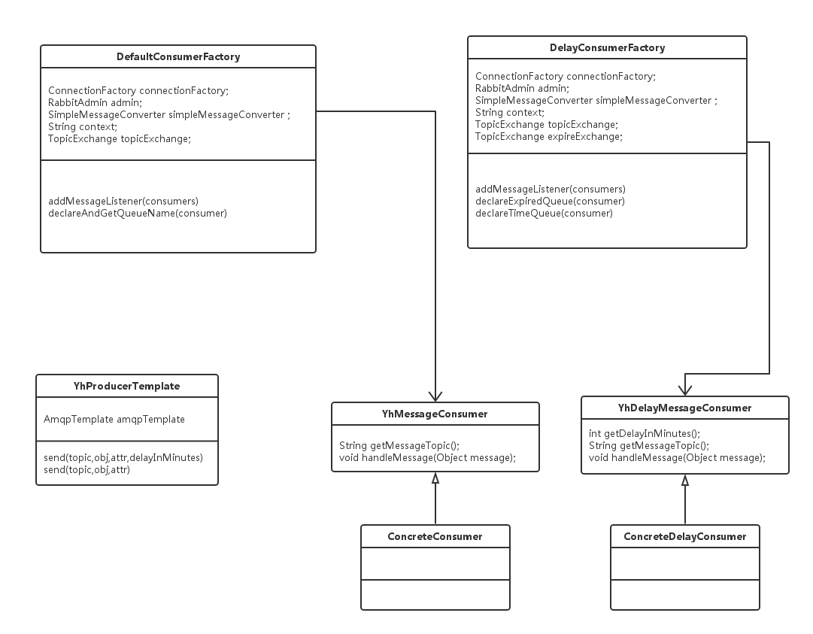
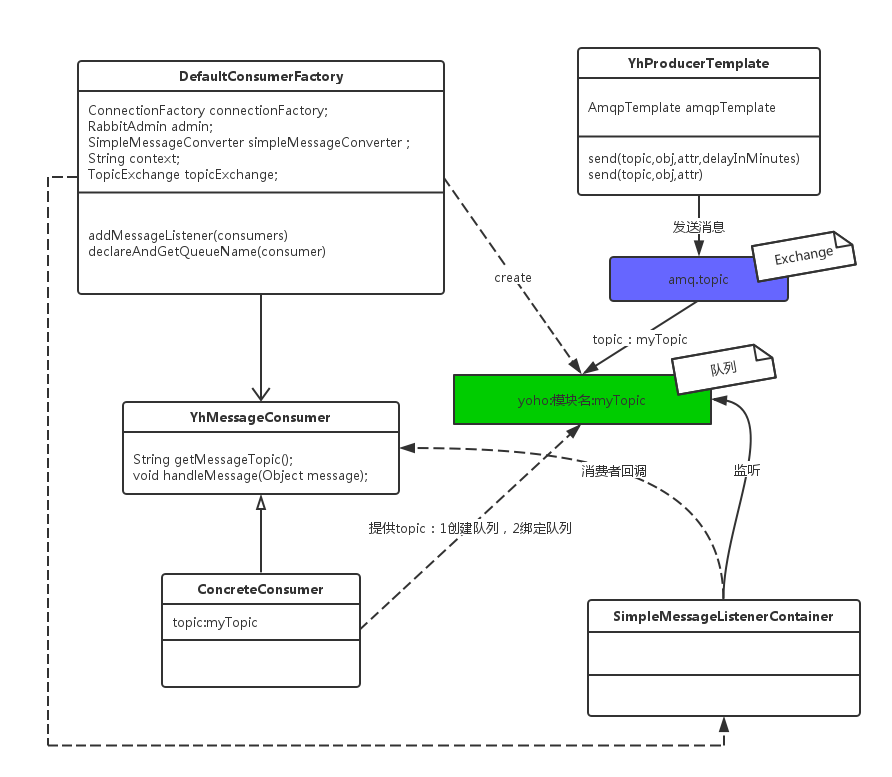
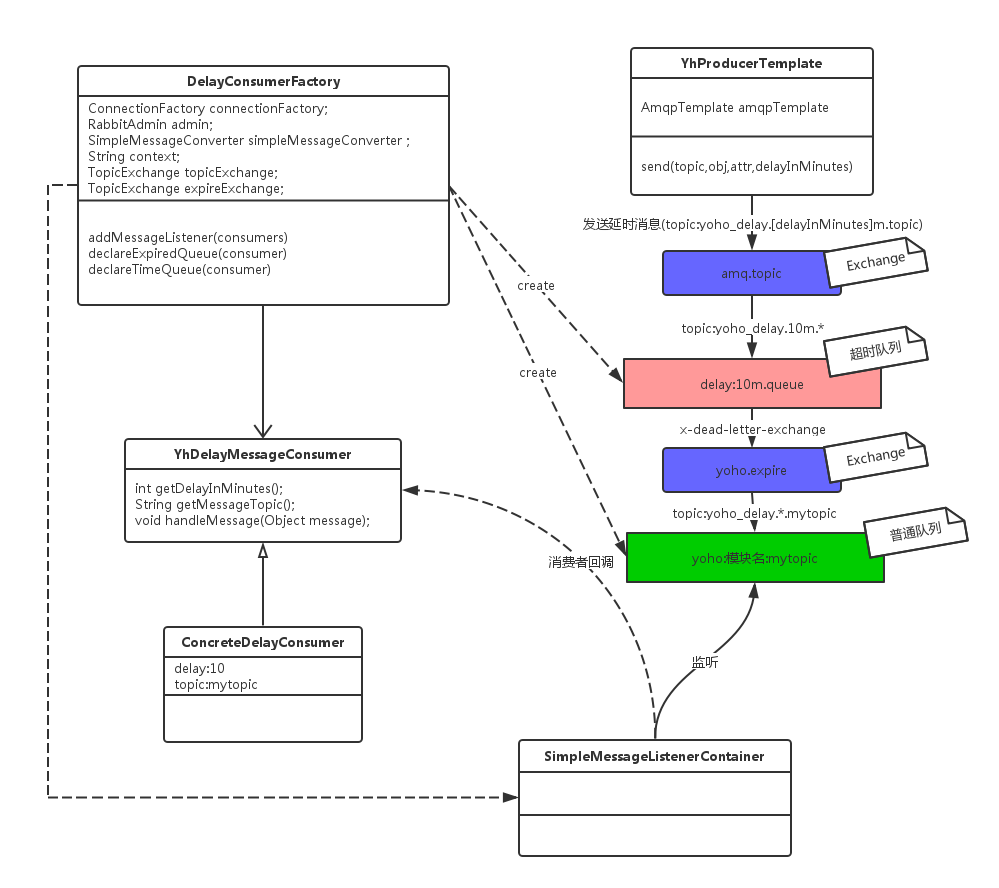

# MQ

### yoho MQ

### 相关类图

消息发送通过YhProducerTemplate发送，其有几个重载的函数，最终只有两类，延时消息和普通消息。生产者Producer调用以下两个接口就可以完成消息的传送。

- 普通消息发送接口：
```java
send(String topic, Object object, Map<String, Object> attributes)
```
- 延时消息发送接口：
```java
send(String topic, Object object, Map<String, Object> attributes，int delayInMinutes)
```
  

延时消息发送接口内部也是调用普通消息进行发送，不过其会根据延时时间发送到指定的延时队列中.

而对于消费者Consumer，不管是普通消息的消费者还是延时消息的消费者，yoho-core中需要完成两件事情。

 1. 根据消费者建立消息队列
 2. 注册MQ消费者

yoho-core定义了两种消费者的接口，与以上两个过程有着密切的关系。
YhMessageConsumer为普通消费者接口
YhDelayMessageConsumer为延时消费的消费者接口

DefaultConsumerFactory 负责普通消费者的相关初始化过程
DelayConsumerFactory 负责延时消费者的相关初始化过程

### 普通消息队列
```java
public interface YhMessageConsumer {
    String getMessageTopic();  //指定消息的主题
    void handleMessage(Object message);  //消息处理
}
```

## DefaultConsumerFactory初始化过程
####  1. getBeans （Type:YhMessageConsumer）
####  2. 遍历YhMessageConsumer list
#### 3. 创建SimpleMessageListenerContainer -> listenerContainer
#### 4. 初始化设置listenerContainer
#### 5. 设置消费者，通过适配器适配(MessageListenerAdapter会适配YhMessageConsumer的handleMessage方法)。
　这里也可以让YhMessageConsumer实现MessageListener接口作为消息处理监听者。
#### 6. 创建队列 
##### 6.1. 创建queue  name：yoho:模块名:getMessageTopic
##### 6.2. 绑定queue<----->amq.topic<------>getMessageTopic
##### 6.3. 返回队列名new_queue
#### 7. listenerContainer设置监听队列名new_queue
#### 8. 启动listenerContainer

#### 下图是大致初始化相关图：

 

### 延时消息队列
Rabbit MQ通过TTL与DLX可以实现延时消息队列。
可以对队列或者消息设置TTL属性，这里主要使用TTL队列。
设置队列为TTL主要通过设置队列属性**x-message-ttl**,单位为ms。
TTl队列内的消息在到达ttl时间时就过期成为一个deadMsg。利用DLX，MQ可以将deadMsg再次进行转发，转发到哪呢，可以通过设置**x-dead-letter-exchange**来指定deadMsg转发到这个exchange，yoho-core中使用*yoho.expire*来接收deadMsg。
还可以通过设置**x-dead-letter-routing-key**来指定deadMsg过期后转发使用的routing-key,yoho-core并没有使用这个属性，因此deadMsg超时后转发时使用原来这个消息发送时的routing-key。
  
  
  **x-message-ttl**   : 队列超时时间
  
  
  **x-dead-letter-exchange** ：超时消息被丢弃到这里
  
  
  **x-dead-letter-routing-key** : 超时消息被丢弃时使用的routing-key
  
  
  然后我们需要创建一个队列(final_queue)专门来接收这些deadMsg，队列需要绑定到x-dead-letter-exchange，如果有x-dead-letter-routing-key的话通过其订阅消息，如果未设置x-dead-letter-routing-key，则通过原来的routing-key进行订阅消息。<br>
  
  
  最后延时消息的消费者通过订阅处理final_queue队列，实现消息的延时处理。


## DelayConsumerFactory初始化过程
#### 1 getBeans （Type:YhDelayMessageConsumer）
#### 2 遍历YhDelayMessageConsumer list
#### 3 创建SimpleMessageListenerContainer -> listenerContainer
#### 4 初始化设置listenerContainer
#### 5 设置消费者，通过适配器适配(MessageListenerAdapter会适配YhMessageConsumer的handleMessage方法)。
　这里也可以让YhMessageConsumer实现MessageListener接口作为消息处理监听者。
#### 6 创建延时队列
##### 6.1 创建timeQueue  
　 **name**：  delay:[delayInMinutes]m.queue
　 **x-message-ttl** : delayInMinutes
　 **x-dead-letter-exchange** : yoho.expire
##### 6.2 绑定 
　 delay:[delayInMinutes]m.queue<----->amq.topic<------>yoho_delay.[delayInMinutes]m.*
#### 7 创建最终消费队列
##### 7.1 创建expiredQueue 
 　name：yoho_delay:模块名:getMessageTopic
##### 7.2 绑定
　yoho_delay:模块名:getMessageTopic<----->yoho.expire<------>yoho_delay.*.getMessageTopic
##### 7.3 返回expiredQueue队列名
#### 8 listenerContainer设置监听队列名expiredQueue
#### 9 启动listenerContainer

#### 下图是大致初始化相关图：
 


### 附 spring 整合 RabbitMq
```xml
    <bean id="simpleMessageConverter" class="org.springframework.amqp.support.converter.SimpleMessageConverter"/>
    <rabbit:connection-factory id="rabbitmq-connectionFactory" addresses="${rabbit_host:127.0.0.1:5672}"
                               username="${rabbit_user:yoho}" password="${rabbit_password:yoho}" virtual-host="${rabbit_vhost:yoho}"/>
    <rabbit:template id="amqpTemplate" connection-factory="rabbitmq-connectionFactory"
                     message-converter="simpleMessageConverter"/>
    <rabbit:admin id="rabbitAdmin" connection-factory="rabbitmq-connectionFactory"/>

```

//TODO


