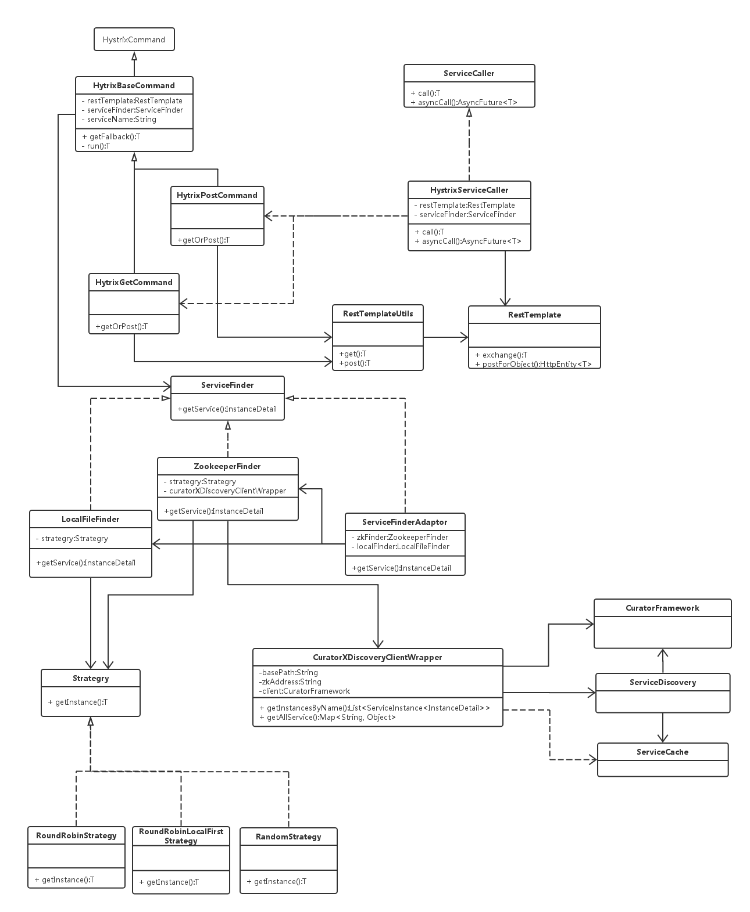

yoho.core服务调用
---
## 一、服务调用所涉及到的组件
### 1.hystrix
Netflix公司开发的处理依赖隔离的框架,同时也是可以帮我们做依赖服务的治理和监控.
Hystrix如何解决依赖隔离：
- 1:Hystrix使用命令模式HystrixCommand(Command)包装依赖调用逻辑，每个命令在单独线程中/信号授权下执行。
- 2:可配置依赖调用超时时间,超时时间一般设为比99.5%平均时间略高即可.当调用超时时，直接返回或执行fallback逻辑。
- 3:为每个依赖提供一个小的线程池（或信号），如果线程池已满调用将被立即拒绝，默认不采用排队.加速失败判定时间。
- 4:依赖调用结果分:成功，失败（抛出异常），超时，线程拒绝，短路。 请求失败(异常，拒绝，超时，短路)时执行fallback(降级)逻辑。
- 5:提供熔断器组件,可以自动运行或手动调用,停止当前依赖一段时间(10秒)，熔断器默认错误率阈值为50%,超过将自动运行。
- 6:提供近实时依赖的统计和监控

    异步调用使用 command.queue()get(timeout, TimeUnit.MILLISECONDS);
    同步调用使用 command.execute() 等同于 command.queue().get();
### 2.RestTemplate
RestTemplate是Spring提供的用于访问Rest服务的客户端，RestTemplate提供了多种便捷访问远程Http服务的方法，能够大大提高客户端的编写效率。
### 3.curator
## 二、yoho.core服务调用实现
### 1.类图如下

### 2.调用过程
用户调用ServiceCaller.call，具体由HystrixServiceCaller执行，生成HytrixPostCommand命令，通过command.queue().get()进行同步调用
Hystrix线程池执行command.run具体过程如下：
- 调用ServiceFinderAdaptor.getService(),ServiceFinderAdaptor先通过ZookeeperFinder查找服务，找不到再通过LocalFileFinder通过本地查找（会定期从zookeeper上同步到本地），
- ZookeeperFinder会通过CuratorXDiscoveryClientWrapper调用ServiceDiscovery获取服务，服务有本地缓存并自动更新，ServiceCache保存一个服务的多个提供者（会自动刷新）。
- 获取到服务提供者list后，通过Strategry进行具体的选择策略选取一个服务提供者，
- 得到一个具体的服务提供者后，同过RestTemplateUtils进行具体的http调用。
异步调用只是不调用future.get,返回future，由调用者get。