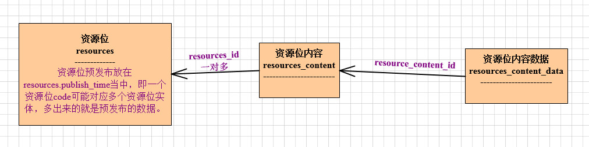
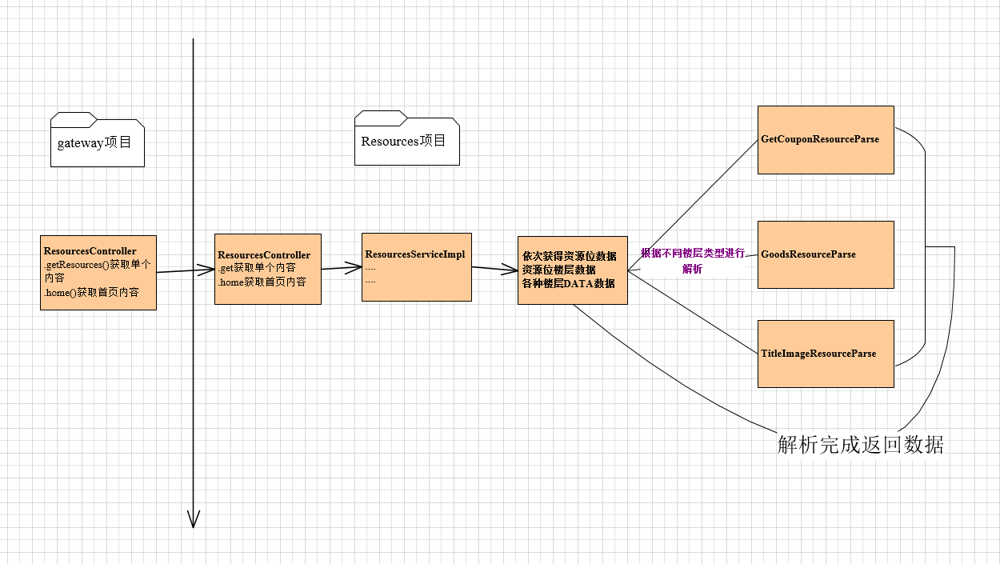

技术部--资源位模型
------------

## 资源位物理模型

资源位
resources
资源位预发布放在resources.publish_time当中，即一个资源位code可能对应多个资源位实体，多出来的就是预发布的数据。

资源位楼层
resources_content

资源位楼层数据
resources_content_data

模型图见 

## 资源位业务模型

资源位业务模型图见

